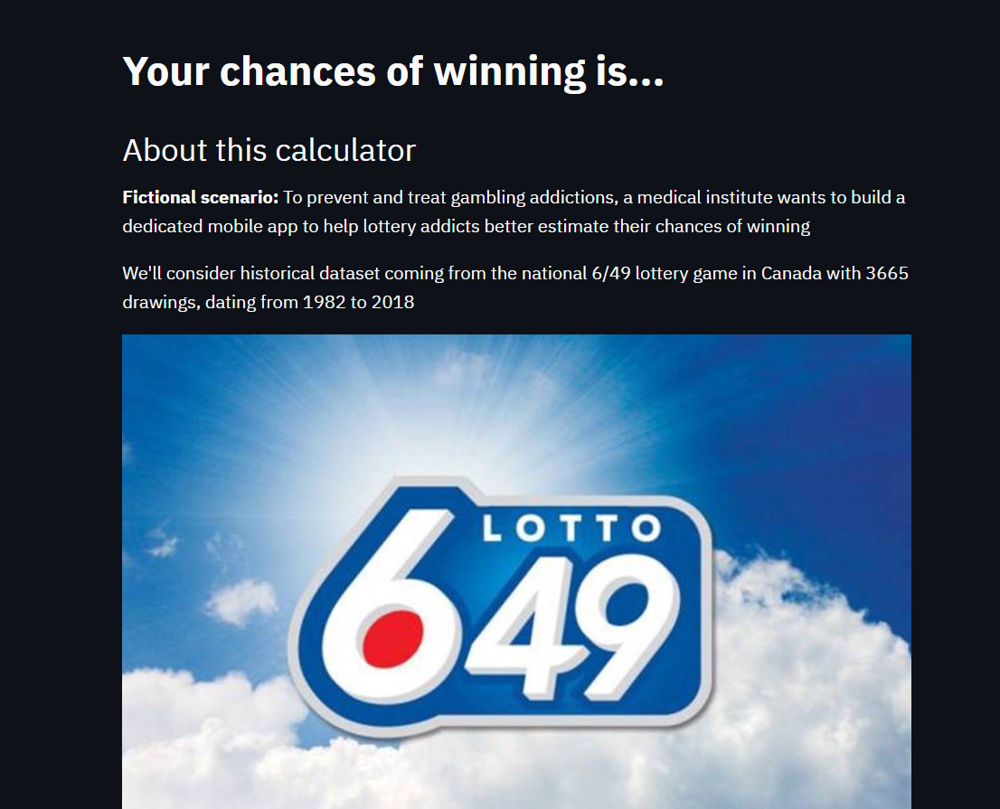

## About The Project

- This analysis is based on the [dataset](https://www.kaggle.com/datascienceai/lottery-dataset) of the national 6/49 lottery game in Canada. This dataset has 3665 drawings dating from 1982 to 2018.

### Built With
* [Python](https://en.wikipedia.org/wiki/Python_(programming_language))
* [Streamlit](https://streamlit.io/)
* [Jupyter Notebook](https://en.wikipedia.org/wiki/Project_Jupyter)

## Usage
- Users can use this app to find out:
- The probability of winning with 1 ticket
  - The probability of winning 2,3,4, or 5 winning numbers
- The probability of winning with multiple ticket
- Check historical data against the Canada dataset to determine whether they would have won by now

#### Contact me

| Contact Method | |
| --- | --- |
| Professional Email | dungvn1999@gmail.com |
| LinkedIn | https://www.linkedin.com/in/dungtran99/ |
| Project Link | [https://github.com/jtran2509/lottery_mobile_app/blob/master/module1.py](https://github.com/jtran2509/lottery_mobile_app/blob/master/module1.py) |
